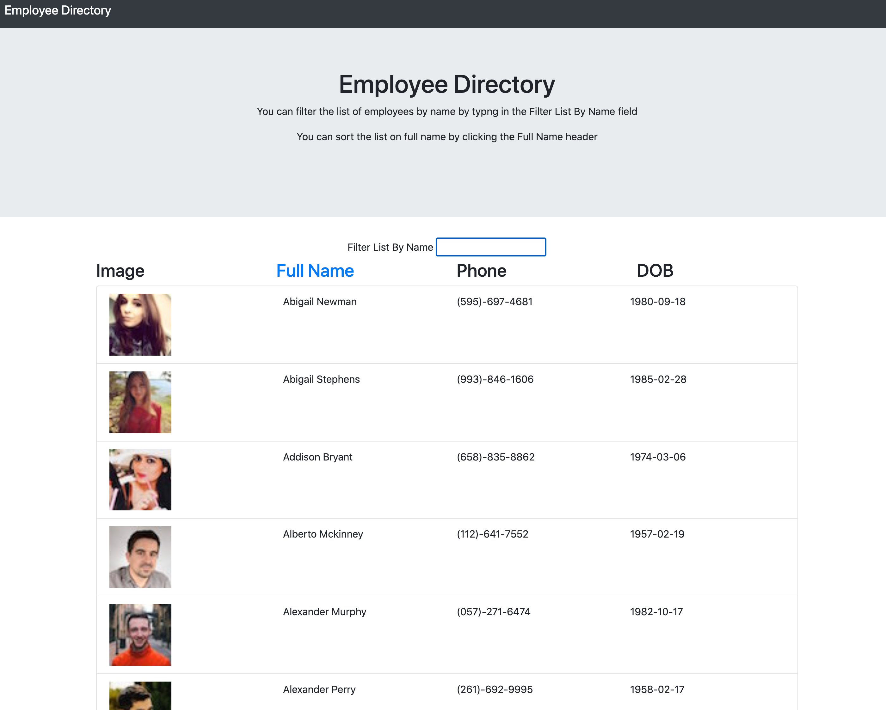

# employeedirectory

[](https://www.gnu.org/licenses/gpl-3.0)


https://n-lambert.github.io/employeedirectory/


## Introduction:

This is a simple employee directory built in reactJS. It allows you to view, search, and sort a list of employees.



## Installation:

To install this project, download the source files from github, and access the folder via your terminal/console of choice. Run ```npm i``` to install dependencies and then use 
```npm start``` to begin the program.

## Usage:

After installation, launch your browser and navigate to http://localhost:3000/employeedirectory


## License:

MIT

## Credits:

Thanks for tips and/or inspiration

- [Plover Brown](https://github.com/rebgrasshopper)
